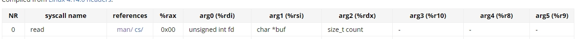
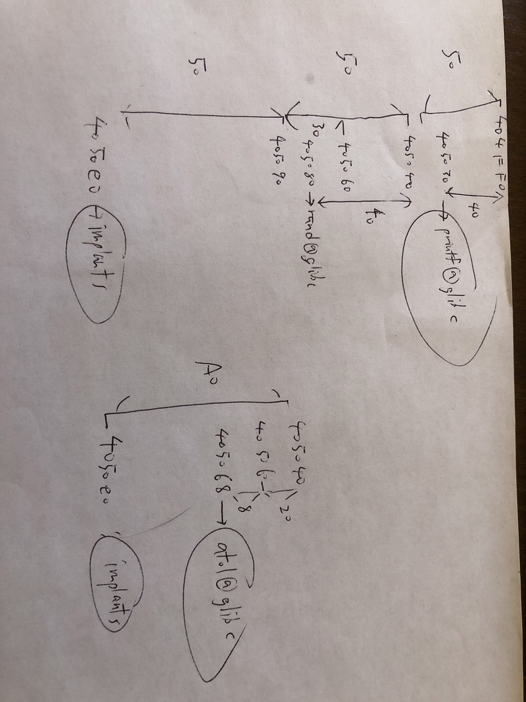

# helloworld            
- return to magic function to call shell
# helloworld_again      
- return to magic function to call shell, but input must start with hellowrld, and ret address must be stack aligned
# sakana                
- use format string to leak pie base and libc base
- then ret2 libc
# modohayaku            
- shellcode must contain certain bytes
# modomodohayaku        
Shellcode must match certain pattern:
- every 6 bytes must start with 0xc 0x87 0x63
- shell code cannot contain 'k','i','r','t','o', NOP
- shell code must be no greater than 96 bytes

Obviously we cannot call execv bin/sh, since this contains 'i'.  
**key point**   We can pass in other shell code from stdin.  
 
1. We set up the registers to call syscall read, as shown below  
  
2. We set rdi to 0, since this is the file descriptor of stdin  
3. we need some address to store our input. It turns out we can use rbp, since its is opcode is just 1 byte. Thus we set rsi to rbp.
4. Set rdx to 0x20, since this is the size of our second shell code
5. Set rax to zero, since 0 is read's syscall number
6. Syscall
7. Call rbp, this executes our second payload, stored in rbp.
# modomodomodohayaku   
- not solved
# cyberpsychosis        

- find libc base with showinfo
- overwrite atol's got address with libc system with edit_info
- input bin sh into buffer
- buffer gets passed into system
# Test_Subject_087      
- not solved
# project_alicization   
- guess password using the same srand(time(0))
- input shellcode that contain all ascii bytes
# guitar_hero           
- not solved
# how2know
- not solved
- leak the flag address with rdi
- write a shell code that compares each character of the flag, and exit upon a match
# rop++
- solution1:
    - set up rop chain to read bin/sh into bss segment
    - call syscall execv
- solution2:
    - mov bin/sh to datas segment
    - call syscall execv